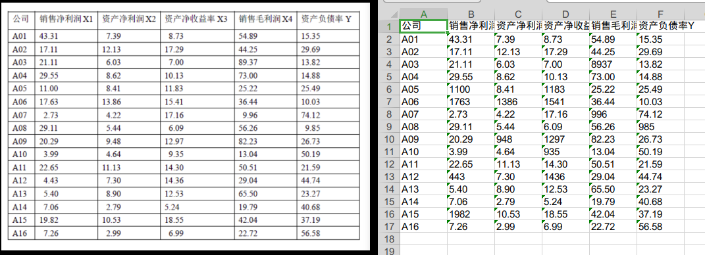

# table_ocr_0.1
generate an excel file from a picture of a table

## 根据表格图像生成表格文件
    这一小段代码可以从一个简单的表格图片中生成表格文件，如下

    项目的起源是一个作业中只有一个表格的图片，需要手工把数据输入，这的确惹恼了一个计算机专业的学生 #_#

## 依赖安装

    pip install opencv-python
    pip install numpy
    pip install openpyxl
    pip install baidu-aip

## 实现

    使用投影的方法把表格图片按每个单元格分割开，因此只适用于标准的表格图片，而且不存在单元格合并的情况

    调用百度ocr API识别单元格中的文字

    将每个单元格的内容写入excel文件中

## 使用

    将项目clone到本地

    安装依赖

    将需要识别的表格图片放到./res/ora中

    到./src中执行 python3 main.py

    结果在./res/excel中

## 配置文件

    配置文件位于 ./res/conf.json

    '''
    {
	"bd":{
		"app_id": "***",
		"api_key": "***",
		"secret_key": "***"
	},
	"us":{
		"mode": "0",                                      
		"ora_path": "../res/ora",
		"excel_path": "../res/excel"
	}
    }
    '''

    其中bd中的信息是百度[OCR API](https://ai.baidu.com/forum/topic/show/867951)的配置信息，请自己申请应用替换信息，免费。

    mode是识别的模式
    
        0-快速，精确度低，每天50000次免费使用，适用于图片的分辨率高
        
        1-较慢，精确度高，每天500次免费使用，适用于图片的分辨率低

    ora_path是识别图片的存放路径
    excel_path是结果的存放路径